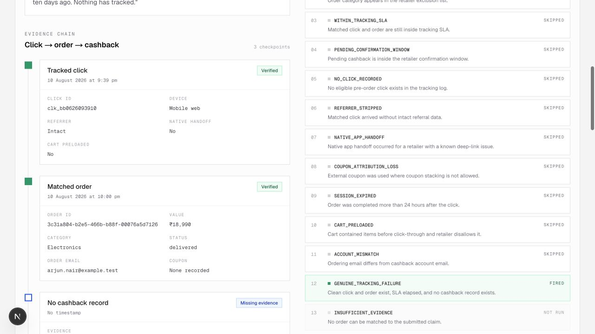

# ClaimDesk

Missing cashback is both a support-cost problem and a trust problem. Most claims send an agent digging through click logs, orders and retailer rules even when the available evidence already implies one specific answer.

ClaimDesk tests a simple product thesis: **deterministic evidence can resolve a large share of missing-cashback claims immediately, while genuine failures should reach an agent already diagnosed and filing-ready.** It is a working Next.js prototype backed by Supabase, not a mock or a slide deck.

> Live product: **[claimdesk-chi.vercel.app](https://claimdesk-chi.vercel.app/demo)**

## A four-minute review

Start at `/demo`. The eight buttons submit real claims against seeded click, order and retailer evidence. The shortest useful path is:

1. **App handoff** — platform-side failure plus a visible three-check goodwill decision.
2. **Vague** — one information-gain question, followed by a visibly updated diagnosis.
3. **Real failure** — a clean tracking failure routed to `/agent` with its evidence and network packet.
4. **Impact** — conservative deflection metrics with editable assumptions.

The language model does not select a diagnosis. Groq parses free text and may polish the final message; ordered TypeScript rules decide the outcome. Both AI jobs have complete deterministic fallbacks.

## What the agent receives

An escalation opens with the matched click → order → cashback chain beside the ordered rule trace. The first matching rule is highlighted and the network packet is ready to copy.

## Diagnosis taxonomy

| Code | Evidence test | Product route |
|---|---|---|
| `WITHIN_TRACKING_SLA` | Click and order exist; click is still inside the retailer SLA | Auto-resolve with exact due time |
| `PENDING_CONFIRMATION_WINDOW` | Cashback is pending; delivered order is inside the confirmation window | Auto-resolve with exact date |
| `ORDER_CANCELLED_OR_RETURNED` | Order is cancelled or returned | Auto-resolve; explain reversal |
| `EXCLUDED_CATEGORY` | Order category appears in retailer exclusions | Auto-resolve; name category and terms |
| `NO_CLICK_RECORDED` | No eligible pre-order click exists | Auto-resolve with cause and prevention tips |
| `REFERRER_STRIPPED` | Click exists without intact referral data | Auto-resolve; evaluate goodwill |
| `NATIVE_APP_HANDOFF` | Native handoff occurred on a known broken deep link | Auto-resolve; evaluate goodwill |
| `COUPON_ATTRIBUTION_LOSS` | External coupon conflicts with retailer stacking policy | Auto-resolve; explain attribution |
| `SESSION_EXPIRED` | Purchase happened more than 24 hours after click | Auto-resolve |
| `CART_PRELOADED` | Cart was preloaded and retailer disallows it | Auto-resolve |
| `ACCOUNT_MISMATCH` | Ordering email differs from account email | Ask one question, then human verification |
| `GENUINE_TRACKING_FAILURE` | Clean click and order; SLA elapsed; no cashback record | Escalate to affiliate network |
| `INSUFFICIENT_EVIDENCE` | No order can yet be matched | Ask the highest-information question, then rerun |

Cancellation and exclusion deliberately outrank timing. The engine never tells a customer to wait for cashback that cannot arrive.

## Seeded impact

The repeatable seed contains 60 claims, 25 synthetic users and six invented retailers:

| Outcome | Claims | Share |
|---|---:|---:|
| Auto-resolved | 35 | 58.3% |
| Needs one answer | 8 | 13.3% |
| Escalated | 17 | 28.3% |

At the dashboard defaults of **₹45 per human-handled claim** and **11 minutes average handle time**, those 35 resolved claims represent an estimated **₹1,575 and 6 hours 25 minutes avoided** for this 60-claim sample. These are editable, point-in-time assumptions—not annualised savings. Clarifications and escalations receive no deflection credit.

## What I would instrument in production

- Claim reopen rate by diagnosis code, especially after auto-resolution.
- Goodwill-credit approval, exception and abuse rates by user cohort.
- CSAT for auto-resolved, clarified and human-resolved claims.
- Order-match precision and the rate at which agents override a diagnosis.
- Network acceptance rate and ageing for genuine tracking failures.
- Drop-off and time-to-answer for each clarifying question.

## What I would build next

1. Shadow-mode evaluation against historical claims, with agent override reasons.
2. Signed retailer/network adapters and an auditable claim-submission state machine.
3. Reopen handling that treats disagreement as new evidence, not user error.
4. Abuse controls for goodwill credits and account-mismatch verification.
5. Rule-version reporting so every decision can be reproduced after policy changes.

## Run locally

1. Run `supabase/migrations/20260820000000_initial_schema.sql` in a Supabase project.
2. Copy `.env.example` to `.env.local` and add the public Supabase values, the seed-only service-role values and optional `GROQ_API_KEY`. Never commit this file.
3. Run `npm install`, `npm run seed`, then `npm run dev`.
4. Use `npm test`, `npm run lint`, `npm run typecheck` and `npm run build` before deployment. `npm run seed -- --dry-run` validates the exact seed mix without database writes.

For a clean review dataset after local testing, `npm run seed -- --reset-claims`
removes only non-seed synthetic claims before restoring the deterministic 60.

## Independence and provenance

**ClaimDesk is an independent prototype built entirely on synthetic data. It is unaffiliated with and not endorsed by any company.** All retailer names, people, transactions and evidence are invented. The failure modes are inferred from public affiliate-tracking documentation and common web-attribution mechanics, not from internal company knowledge. No company logo, trademark or brand colour is used.
